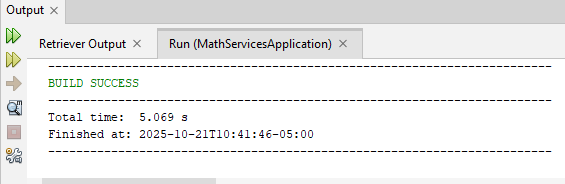
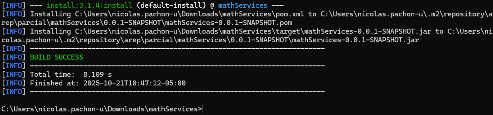

# Parcial Corte 2
**Realizado por:** Nicolás Pachón Unibio

### Introducción

El ejercicio a realizar es de desplegar un servicio web que atienda problemas matematicos,
en este caso siendo problemas de *factores y primos*, el cual posee la siguiente estructura:

- **Input:** un numero entero (el proxy se encargara de definir si retorna factor o primo)
- **Output:** lista de valores asociados al numero (sus numeros factores o primos)

para esto se manejaran 3 instancias EC2, donde en 2 se alojaran los servicios de factores y primos respectivamente,
mientras que en la tercera se encontrara el proxy encargado de solicitar la operacion acorde a si es
factor o primo, con el cual el cliente se comunicara mediante un formulario realizado en HTML.

### Ejercicio

para resolver este ejercicio se tiene en cuenta los siguientes elementos:

- se necesita una clase encargada de recibir las peticiones y dirigirlas al metodo solicitado
- se necesita un formulario con el cual el usuario pueda ingresar la información a manejar (en este
  caso un numero)
- son 2 metodos aparte, uno para calcular primos y otro para calcular factores
- ambas instancias EC2 debe contener el mismo programa, no obstante el algoritmo de round-robin se encarga de
  dirigirlo hacia la instancia de primos o factores

### Realización

en este repositorio estan alojados los siguientes elementos:

- **service:** clase encargada de tener los parametros necesarios para la salida solicitada (method,input,output)
- **mathFactor:** clase con el metodo solicitado de conocer los factores de un numero
- **mathPrime:** clase con el metodo solicitado de devolver los numeros primos hasta el numero ingresado
- **index:** html que contiene los formularios para solicitar estos metodos

una vez hecho esto, se procedio a crear las instancias de EC2 que contenian dentro el paquete de mathServices para
su funcionamiento.

### instancias

antes que nada hay que verificar que todo este compilando, esto se puede realizar de 2 formas, la primera siendo
mediante algun ide, eligiendo el archivo *MathServicesApplication* y la opcion de *run File*



la segunda vendria siendo mediante una terminal abierta en el archivo, y de ahi ejecutar el comando

```
mvn install
```


#### AWS

con esto presente, procedemos a subirlas al curso de AWS, en donde se manejaron las siguientes instancias:


 
